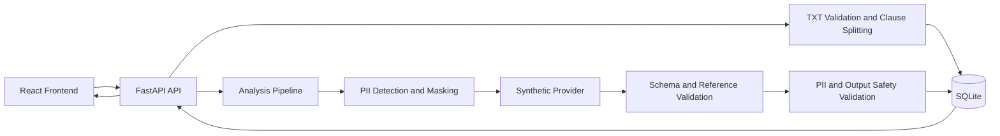

# ContractCheck AI

계약 문서를 조항 단위로 분리하고, 개인정보 보호와 출력 검증을 거쳐 위험 신호와 검토 권고를 제공하는 계약서 리스크 관리 MVP입니다.

> **현재 상태: 개발 중 · 기술 검증 MVP**
>
> 외부 모델을 연결하기 전에 결정론적 합성 Provider로 데이터 전달 경계, 결과 검증, 오류 처리와 Frontend·Backend 통합 구조를 먼저 검증했습니다. 실제 외부 Provider와 운영 환경은 아직 연결하지 않았습니다.

## 핵심 기술 포인트

- **조항 단위 결과 추적:** `clause_id`와 `reference_id`를 함께 검증해 결과가 다른 조항에 연결되는 것을 차단
- **개인정보 전달 경계:** Provider 입력 전 탐지·마스킹을 수행하고 마스킹 후 잔여 개인정보를 재검사
- **출력 안전성 검증:** schema, 참조 식별자, 개인정보 재생성과 법률 확정·보장 표현을 저장 전에 검사
- **일관된 실패 처리:** 한 조항이라도 검증에 실패하면 부분 결과를 rollback하고 작업 실패 상태를 보존
- **통합 검증:** React와 FastAPI를 실제 Chrome에서 연결해 업로드, 분석, 결과 조회, 문서 전환과 오류 재시도를 확인

## 문제 정의

계약서 전체를 하나의 입력과 출력으로 처리하면 결과의 근거 조항을 추적하기 어렵습니다. 개인정보가 외부 분석 경계로 전달될 수 있고, 분석 출력이 개인정보나 단정적인 법률 표현을 다시 만들 가능성도 있습니다.

ContractCheck AI는 문서를 조항 단위로 나누고 입력과 출력 모두를 검증합니다. 분석 모델의 성능보다 먼저 조항 연결, 개인정보 최소화, transaction 안전성과 사용자 흐름을 확인하는 데 집중했습니다.

## 핵심 사용자 흐름

```text
UTF-8 TXT 선택 및 사전 검증
→ 문서 업로드
→ 메타데이터와 분리 조항 확인
→ 분석 작업 생성 및 상태 확인
→ 합성 분석 결과 조회
→ 조항별 라벨·요약·전문가 검토 권고 확인
→ 새 문서 선택 시 이전 상태 초기화
```

## 주요 기능

### Frontend

- TXT 확장자, 빈 파일과 1 MiB 초과 사전 검증
- 문서 메타데이터, 분리 조항, 경고와 미분류 영역 표시
- 분석 작업 생성과 `queued`, `processing`, `completed`, `failed` 상태 처리
- 수동 상태 재조회와 완료 결과 조회
- `clause_id`·`reference_id` 기반 조항과 결과의 일대일 연결 검증
- 단계별 오류와 재시도, 새 문서 선택 시 상태 초기화
- 320px부터 대응하는 반응형 화면과 접근성 상태 전달

### Backend

- FastAPI 기반 6개 REST API
- UTF-8 TXT 한 파일, 최대 1 MiB 입력 검증과 조항 분할
- SQLAlchemy·SQLite 기반 문서, 조항, 작업과 결과 저장
- 교체 가능한 Provider 인터페이스와 `SyntheticAnalysisProvider`
- 개인정보 탐지·마스킹, 잔여 개인정보와 출력 재생성 검사
- 결과 schema, 허용 라벨과 `reference_id` 검증
- 법률 확정·보장 표현 차단과 안전한 결과만 저장
- Provider 오류 분류, 부분 결과 rollback과 실패 상태 보존

## 아키텍처



합성 Provider는 외부 통신 없이 같은 입력에 예측 가능한 결과를 반환합니다. 이를 통해 실제 모델 품질과 분리된 상태에서 개인정보 보호, 결과 연결, transaction과 화면 흐름을 반복 검증했습니다.

## 기술 스택

| 영역 | 기술 |
|---|---|
| Frontend | React, TypeScript, Vite |
| UI | Bootstrap 5, CSS |
| Backend | Python, FastAPI, Uvicorn |
| Database | SQLAlchemy, SQLite |
| Frontend testing | Vitest, Testing Library, jsdom |
| Backend testing | pytest, FastAPI TestClient |
| Quality | ESLint, Ruff |

## 로컬 실행

Windows PowerShell과 저장소 루트를 기준으로 합니다.

### 저장소 준비

```powershell
git clone https://github.com/wlrjs1300-coder/Contract-check-ai.git
cd Contract-check-ai
```

### Backend

```powershell
python -m venv backend\.venv
.\backend\.venv\Scripts\python.exe -m pip install -r backend\requirements.txt
.\backend\.venv\Scripts\python.exe -m uvicorn backend.app.main:app --reload --host 127.0.0.1 --port 8000
```

기본 실행은 저장소 루트에 Git 비추적 SQLite 파일 `contract_check.db`를 생성할 수 있습니다.

### Frontend

새 PowerShell에서 실행합니다.

```powershell
cd frontend
npm.cmd install
npm.cmd run dev
```

- Frontend: `http://localhost:5173`
- Backend health: `http://localhost:8000/health`
- API 문서: `http://localhost:8000/docs`

별도 환경변수 없이 기본값으로 실행할 수 있으며 실제 `.env` 파일은 커밋하지 않습니다.

### 환경변수

| 이름 | 목적 | 기본값 | Secret 여부 |
|---|---|---|---|
| `DATABASE_URL` | SQLAlchemy DB 연결 | `sqlite:///./contract_check.db` | 연결 정보에 따라 달라짐 |
| `CORS_ALLOWED_ORIGINS` | 허용 Frontend origin | `http://localhost:5173` | 아님 |
| `VITE_API_BASE_URL` | 브라우저가 호출할 API 주소 | `http://localhost:8000` | 아님 |

`CORS_ALLOWED_ORIGINS`는 쉼표로 여러 origin을 받을 수 있지만 wildcard를 거부합니다. `VITE_` 변수는 브라우저에 노출될 수 있으므로 비밀값을 넣지 않습니다.

임시 DB가 필요하면 Backend 실행 전에 PowerShell 세션에서 지정할 수 있습니다.

```powershell
$env:DATABASE_URL = "sqlite:///./local.db"
```

## 테스트 및 검증

### Frontend

```powershell
cd frontend
npm.cmd audit
npm.cmd run lint
npm.cmd run test -- --run
npm.cmd run build
```

### Backend

저장소 루트에서 실행합니다.

```powershell
.\backend\.venv\Scripts\python.exe -m pytest backend\tests -q
.\backend\.venv\Scripts\python.exe -m ruff check backend
```

v0.4.6 통합 검증 결과:

- Frontend: 테스트 파일 8개, 테스트 105개 통과
- Backend: 테스트 53개 통과
- npm audit: 취약점 0건
- ESLint, Ruff와 Vite production build 통과
- Chrome에서 두 문서의 업로드·분석·전환과 네트워크 오류 재시도 검증
- 320px, 375px, 576px, 768px viewport 검증

## 현재 범위와 한계

현재 MVP는 UTF-8 TXT 한 파일을 최대 1 MiB까지 처리합니다. 실제 외부 Provider, PDF·OCR, 인증·인가, 사용자별 이력, 운영 DB와 배포는 구현하지 않았습니다. 분석은 작업 생성 요청 안에서 동기 실행되며 자동 폴링과 프로세스 재시작 후 복구를 지원하지 않습니다.

업로드 파일 자체는 저장하지 않지만 분리된 조항 본문은 SQLite에 저장됩니다. 현재 인증과 사용자 격리가 없으므로 실제 계약서나 실제 개인정보를 입력하면 안 됩니다. Provider 전달 전 마스킹과 출력 검증은 규칙 기반 기술 검증이며 모든 개인정보나 위험 조항 탐지를 보장하지 않습니다.

## 상세 문서

- [프로젝트 개요](docs/portfolio/project-overview.md): 담당 범위, 기술적 의사결정과 문제 해결 과정
- [배포 준비 조건](docs/deployment/deployment-readiness.md): 운영 DB, 보안, 로그와 배포 전 확인 사항
- [폴더 구조](docs/05-folder-structure.md): 현재 저장소의 상세 구조
- [버전 관리 규칙](docs/01-versioning-rules.md): 실제 작업 이력과 버전 운영 원칙

## 면책

현재 결과는 합성 Provider를 사용한 기술 검증 결과이며 실제 외부 분석 품질을 검증한 것이 아닙니다. 이 프로젝트는 법률 자문이나 최종 판단을 제공하지 않으며 적법성, 위법성, 무효 여부 또는 계약서의 안전을 확정하지 않습니다.
