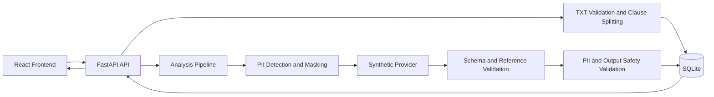

# ContractCheck AI

계약 문서를 조항 단위로 분리하고, 안전한 분석 파이프라인을 통해 위험 신호와 검토 권고를 제공하는 계약서 리스크 관리 MVP입니다.

> 현재 상태: **개발 중 · 기술 검증 MVP**
>
> 프론트엔드·백엔드 통합 흐름을 합성 Provider로 검증했습니다. 실제 외부 분석 서비스나 운영 환경은 연결되어 있지 않습니다.

## 문제 정의

- 계약서는 일반 사용자가 검토할 조항을 빠르게 구분하기 어렵습니다.
- 전체 문서를 한 번에 분석하면 결과가 어느 조항에서 나왔는지 연결하고 검증하기 어렵습니다.
- 문서에는 개인정보가 포함될 수 있으므로 외부 분석 전에 탐지와 마스킹 경계가 필요합니다.
- 분석 출력도 법률 확정 표현이나 개인정보를 포함할 수 있으므로 신뢰하지 않고 검증해야 합니다.
- 문서, 조항, 분석 결과를 식별자로 연결해 잘못된 결과 매핑을 차단해야 합니다.

이 프로젝트는 이러한 기술적 문제를 작은 범위에서 검증합니다. 법률 서비스나 계약 효력 판정 서비스를 제공하는 것이 목적은 아닙니다.

## 현재 상태

구현 및 검증 완료:

- UTF-8 TXT 한 파일 업로드와 입력 검증
- 문서 메타데이터와 조항 분리 결과 확인
- 분석 작업 생성과 상태 조회
- 합성 분석 결과 조회와 조항별 연결
- Provider 전달 전 개인정보 탐지·마스킹과 잔여 개인정보 검사
- 결과 schema, `reference_id`, 개인정보 재생성 및 출력 안전성 검증
- 프론트엔드·백엔드 실제 브라우저 통합 흐름 검증

현재 미구현:

- 승인된 실제 외부 Provider
- PDF·OCR
- 인증·인가와 사용자별 접근 제어
- 사용자별 분석 이력
- 운영 DB, 배포 및 작업 복구

## 핵심 사용자 흐름

1. UTF-8 TXT 파일을 선택합니다.
2. 파일 형식, 빈 파일 여부와 크기를 확인합니다.
3. 문서를 업로드합니다.
4. 메타데이터와 분리된 조항을 확인합니다.
5. 분석을 시작합니다.
6. 작업 상태를 확인합니다.
7. 완료된 분석 결과를 조회합니다.
8. 조항별 라벨, 요약과 전문가 검토 권고를 확인합니다.
9. 새 문서를 선택하면 이전 문서와 분석 상태를 초기화합니다.

자동 폴링, PDF 업로드, 로그인과 분석 이력은 현재 사용자 흐름에 포함되지 않습니다.

## 주요 기능

### Frontend

- TXT 확장자, 빈 파일과 1 MiB 초과 사전 검증
- 업로드 상태와 안전한 한국어 오류 메시지 처리
- 문서 메타데이터, 분리 조항, 경고 및 미분류 영역 표시
- 분석 작업 생성, 네 가지 상태 표시와 수동 상태 재조회
- 완료된 결과 조회와 조항·결과 일대일 연결 검증
- 라벨 원문, 요약과 전문가 검토 권고 표시
- 새 문서 선택 시 이전 상태 초기화
- 작은 화면 대응과 접근성 상태 전달

### Backend

- FastAPI 기반 6개 REST API
- TXT 확장자, 최대 1 MiB 및 UTF-8 검증
- 조항 분할과 SQLAlchemy·SQLite 저장
- 분석 작업의 `queued`, `processing`, `completed`, `failed` 상태 관리
- 교체 가능한 Provider 인터페이스와 `SyntheticAnalysisProvider`
- Provider 최소 입력 생성 전 개인정보 탐지·마스킹
- 마스킹 후 잔여 개인정보 검증
- 결과 schema와 `reference_id` 검증
- Provider 응답의 개인정보 재생성과 법률 확정·보장 표현 차단
- 재시도 가능 오류와 즉시 실패 오류 분류
- 실패 시 부분 결과 rollback과 작업 실패 상태 보존

## 기술 스택

| 영역 | 기술 |
|---|---|
| Frontend | React, TypeScript, Vite |
| UI | Bootstrap 5, CSS |
| Backend | Python, FastAPI, Uvicorn |
| Database | SQLAlchemy, SQLite |
| Frontend testing | Vitest, Testing Library, jsdom |
| Backend testing | pytest, FastAPI TestClient |
| Quality | ESLint, Ruff |
| Development | Git, GitHub, Markdown |

장기 기술 기획과 달리 현재 코드에는 MySQL, Alembic, JWT, 작업 큐와 실제 외부 Provider가 적용되어 있지 않습니다.

## 아키텍처



업로드된 전체 파일 자체는 저장하지 않지만 현재 SQLite에는 문서 메타데이터와 분리된 조항 본문이 저장됩니다. 인증·사용자 격리가 없으므로 실제 계약서 처리에 사용할 수 있는 운영 구조가 아닙니다.

## 로컬 실행

Windows PowerShell과 저장소 루트를 기준으로 합니다.

### 1. 저장소 준비

```powershell
git clone https://github.com/wlrjs1300-coder/Contract-check-ai.git
cd Contract-check-ai
```

### 2. Backend

```powershell
python -m venv backend\.venv
.\backend\.venv\Scripts\python.exe -m pip install -r backend\requirements.txt
.\backend\.venv\Scripts\python.exe -m uvicorn backend.app.main:app --reload --host 127.0.0.1 --port 8000
```

기본 실행은 저장소 루트에 `contract_check.db`를 생성할 수 있습니다. 이 파일은 Git 추적 대상이 아닙니다.

### 3. Frontend

새 PowerShell에서 실행합니다.

```powershell
cd frontend
npm.cmd install
npm.cmd run dev
```

- Frontend: `http://localhost:5173`
- Backend health: `http://localhost:8000/health`
- API 문서: `http://localhost:8000/docs`

별도 환경변수 없이 기본값으로 로컬 실행할 수 있습니다. 실제 `.env` 파일은 저장소에 커밋하지 않습니다.

## 환경변수

| 이름 | 목적 | 기본값 | Secret 여부 | 안전한 예시 |
|---|---|---|---|---|
| `DATABASE_URL` | SQLAlchemy DB 연결 | `sqlite:///./contract_check.db` | 배포 설정에 따라 달라짐 | `sqlite:///./local.db` |
| `CORS_ALLOWED_ORIGINS` | 허용할 Frontend origin 목록 | `http://localhost:5173` | 아님 | `http://localhost:5173` |
| `VITE_API_BASE_URL` | 브라우저가 호출할 API 기본 주소 | `http://localhost:8000` | 아님 | `http://localhost:8000` |

`CORS_ALLOWED_ORIGINS`는 쉼표로 여러 origin을 받을 수 있지만 wildcard는 거부됩니다. 운영에서는 실제 Frontend origin만 허용해야 합니다. `VITE_` 변수는 브라우저 번들에 노출될 수 있으므로 어떠한 비밀값도 넣지 않습니다.

PowerShell 세션에서 임시 DB를 사용하려면 Backend 실행 전에 다음처럼 설정할 수 있습니다.

```powershell
$env:DATABASE_URL = "sqlite:///./local.db"
```

## 테스트

### Frontend

```powershell
cd frontend
npm.cmd audit
npm.cmd run lint
npm.cmd run test -- --run
npm.cmd run build
```

### Backend

저장소 루트에서 실행합니다.

```powershell
.\backend\.venv\Scripts\python.exe -m pytest backend\tests -q
.\backend\.venv\Scripts\python.exe -m ruff check backend
```

v0.4.6 통합 검증 기준:

- Frontend: 테스트 파일 8개, 테스트 105개 통과
- Backend: 테스트 53개 통과
- npm audit: 취약점 0건
- 320px, 375px, 576px, 768px Chrome viewport 검증

## 보안 및 데이터 처리 원칙

- 공개 저장소에는 실제 계약서와 실제 개인정보를 포함하지 않습니다.
- 테스트와 검증에는 명백한 합성 fixture만 사용합니다.
- Provider에는 원문 조항 대신 탐지·마스킹과 잔여 개인정보 검사를 거친 최소 입력만 전달합니다.
- Provider 출력도 신뢰하지 않고 개인정보 재생성과 출력 안전성을 검사합니다.
- 검증되지 않은 결과와 원시 Provider 응답은 저장하지 않습니다.
- 분석 실패 시 부분 결과를 rollback합니다.
- 실제 `.env`와 비밀값은 Git으로 추적하지 않습니다.
- 개인정보 탐지는 규칙 기반 기술 검증이며 모든 개인정보 탐지를 보장하지 않습니다.

현재 업로드 조항 본문은 SQLite에 저장되고 접근 제어가 없습니다. 별도 개인정보·보안 검토와 보관 정책이 마련되기 전에는 실제 계약서나 실제 개인정보를 입력하지 마세요.

## 현재 한계

- UTF-8 TXT 한 파일, 최대 1 MiB만 지원
- PDF·OCR과 계약서 유형 선택 미지원
- 합성 Provider 사용, 실제 분석 품질 미검증
- 인증·인가와 사용자별 분석 이력 없음
- SQLite 기반 단일 인스턴스 기술 검증
- 분석 생성 요청 안에서 동기 실행
- 자동 폴링과 프로세스 재시작 후 작업 복구 없음
- 실패 사유 DB 저장과 안정적인 실패 API 계약 없음
- Reviewer workflow 없음
- 운영 배포 미완료
- 실제 screen reader와 전문 색상 대비 측정 미완료

## 로드맵

현재 운영 기록은 이미 병합된 버전명을 유지하며, 이후 범위는 실제 남은 작업을 기준으로 조정합니다.

1. v0.5.x: 공개 문서와 플랫폼 비종속 배포 조건 정리
2. 후속 운영 준비: 배포 환경, 영속 DB, Secret·로그·보관 정책 확정
3. 인증·사용자별 접근 제어와 분석 이력
4. PDF·OCR 입력과 계약서 유형 확장
5. 데이터 처리 조건이 승인된 실제 Provider 연동
6. 전체 보안·접근성·법률 표현 검증 후 MVP 범위 재평가

세부 버전은 [버전 관리 규칙](docs/01-versioning-rules.md)의 변경 기록 원칙에 따라 조정합니다.

## 저장소 구조

```text
contract-check-ai/
├── backend/                  # FastAPI, SQLAlchemy, 분석 파이프라인과 테스트
├── frontend/                 # React 화면, API client와 테스트
├── docs/                     # 규칙, 기획, 체크리스트와 공개 설명 문서
├── spikes/                   # 합성 fixture 기반 기술 검증
├── README.md
└── README_RULES.md
```

상세 구조는 [폴더 구조 규칙](docs/05-folder-structure.md)을 참고하세요. 포트폴리오 관점의 설명은 [프로젝트 개요](docs/portfolio/project-overview.md), 배포 전 조건은 [배포 준비](docs/deployment/deployment-readiness.md)에 정리되어 있습니다.

## 면책 및 주의사항

현재 표시 결과는 합성 Provider를 사용한 화면·API 계약 검증 결과이며 실제 외부 분석 품질이나 법률적 적합성을 검증하지 않습니다. 이 프로젝트는 법률 자문을 제공하지 않고 적법성, 위법성, 무효 여부 또는 특정 법적 결과를 확정하지 않습니다. 전문가 검토 권고가 표시되지 않더라도 안전을 보장하지 않으며 모든 위험 조항 탐지를 보장하지 않습니다.

현재 상태는 개발 중인 기술 검증 MVP이며 실제 서비스 운영 상태가 아닙니다.
