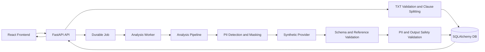

# ContractCheck AI

계약 문서를 조항 단위로 분리하고, 개인정보 보호와 출력 검증을 거쳐 위험 신호와 검토 권고를 제공하는 계약서 리스크 관리 MVP입니다.

> **현재 상태: v0.8.0 기술 검증 MVP · v0.9.0 운영 준비 진행 중**
>
> 결정론적 합성 Provider로 데이터 전달 경계, 결과 검증과 Frontend·Backend 통합 구조를 검증했습니다. MySQL·migration·API·worker의 로컬 Docker smoke는 완료했지만 실제 외부 Provider, 실제 배포 환경과 실제 개인정보 사용은 승인되거나 검증되지 않았습니다.

## 핵심 기술 포인트

- **조항 단위 결과 추적:** `clause_id`와 `reference_id`를 함께 검증해 결과가 다른 조항에 연결되는 것을 차단
- **개인정보 전달 경계:** Provider 입력 전 탐지·마스킹을 수행하고 마스킹 후 잔여 개인정보를 재검사
- **출력 안전성 검증:** schema, 참조 식별자, 개인정보 재생성과 법률 확정·보장 표현을 저장 전에 검사
- **일관된 실패 처리:** 한 조항이라도 검증에 실패하면 부분 결과를 rollback하고 작업 실패 상태를 보존
- **통합 검증:** React와 FastAPI를 실제 Chrome에서 연결해 업로드, 분석, 결과 조회, 문서 전환과 오류 재시도를 확인

## 문제 정의

계약서 전체를 하나의 입력과 출력으로 처리하면 결과의 근거 조항을 추적하기 어렵습니다. 개인정보가 외부 분석 경계로 전달될 수 있고, 분석 출력이 개인정보나 단정적인 법률 표현을 다시 만들 가능성도 있습니다.

ContractCheck AI는 문서를 조항 단위로 나누고 입력과 출력 모두를 검증합니다. 분석 모델의 성능보다 먼저 조항 연결, 개인정보 최소화, transaction 안전성과 사용자 흐름을 확인하는 데 집중했습니다.

## 핵심 사용자 흐름

```text
UTF-8 TXT 선택 및 사전 검증
→ 문서 업로드
→ 메타데이터와 분리 조항 확인
→ 분석 작업 생성 및 상태 확인
→ 합성 분석 결과 조회
→ 조항별 라벨·요약·전문가 검토 권고 확인
→ 새 문서 선택 시 이전 상태 초기화
```

## 주요 기능

### Frontend

- TXT 확장자, 빈 파일과 1 MiB 초과 사전 검증
- 문서 메타데이터, 분리 조항, 경고와 미분류 영역 표시
- 분석 작업 생성과 `queued`, `processing`, `completed`, `failed` 상태 처리
- 수동 상태 재조회와 완료 결과 조회
- `clause_id`·`reference_id` 기반 조항과 결과의 일대일 연결 검증
- 단계별 오류와 재시도, 새 문서 선택 시 상태 초기화
- 320px부터 대응하는 반응형 화면과 접근성 상태 전달

### Backend

- FastAPI 기반 REST API와 JWT 인증
- 사용자별 document·extraction·analysis ownership 및 교차 사용자 접근 차단
- UTF-8 TXT 한 파일, 최대 1 MiB 입력 검증과 조항 분할
- 별도 extraction API를 통한 텍스트 PDF·이미지 OCR·스캔 PDF 처리와 사용자 확인
- PDF 확장자·MIME·시그니처·암호화·손상·20 MiB·100페이지 검증
- 저장소 밖 무작위 temp 경로와 성공·실패 cleanup 검증
- SQLAlchemy와 Alembic 기반 schema, 개발용 SQLite 기본값과 production용 MySQL 8.4 Compose
- AES-256-GCM 저장 암호화, keyring과 HMAC 기반 email lookup
- DB 기반 durable analysis job, 별도 worker, lease·heartbeat·retry·stale recovery
- 교체 가능한 Provider 인터페이스와 `SyntheticAnalysisProvider`
- 개인정보 탐지·마스킹, 잔여 개인정보와 출력 재생성 검사
- 결과 schema, 허용 라벨과 `reference_id` 검증
- 법률 확정·보장 표현 차단과 안전한 결과만 저장
- production runtime 설정 fail-closed, `/health`·`/ready`, structured operational logging

## 아키텍처


```mermaid
flowchart LR
    UI[React Frontend] --> API[FastAPI API]
    API --> DOC[TXT Validation and Clause Splitting]
    DOC --> DB[(SQLAlchemy DB)]
    API --> JOB[Durable Job]
    JOB --> WORKER[Analysis Worker]
    WORKER --> PIPE[Analysis Pipeline]
    PIPE --> MASK[PII Detection and Masking]
    MASK --> SYN[Synthetic Provider]
    SYN --> VALID[Schema and Reference Validation]
    VALID --> SAFE[PII and Output Safety Validation]
    SAFE --> DB
    DB --> API
    API --> UI
```

합성 Provider는 외부 통신 없이 같은 입력에 예측 가능한 결과를 반환합니다. 이를 통해 실제 모델 품질과 분리된 상태에서 개인정보 보호, 결과 연결, transaction과 화면 흐름을 반복 검증했습니다.

## 기술 스택

| 영역 | 기술 |
|---|---|
| Frontend | React, TypeScript, Vite |
| UI | Bootstrap 5, CSS |
| Backend | Python, FastAPI, Uvicorn |
| Database | SQLAlchemy, Alembic, SQLite (개발 기본값), MySQL 8.4 (Compose) |
| Frontend testing | Vitest, Testing Library, jsdom |
| Backend testing | pytest, FastAPI TestClient |
| Quality | ESLint, Ruff |

## 로컬 실행

Windows PowerShell과 저장소 루트를 기준으로 합니다.

### 저장소 준비

```powershell
git clone https://github.com/wlrjs1300-coder/Contract-check-ai.git
cd Contract-check-ai
```

### Backend

```powershell
python -m venv backend\.venv
.\backend\.venv\Scripts\python.exe -m pip install -r backend\requirements.txt
.\backend\.venv\Scripts\python.exe -m uvicorn backend.app.main:app --reload --no-proxy-headers --host 127.0.0.1 --port 8000
```

기본 실행은 저장소 루트에 Git 비추적 SQLite 파일 `contract_check.db`를 생성할 수 있습니다.

### Frontend

새 PowerShell에서 실행합니다.

```powershell
cd frontend
npm.cmd install
npm.cmd run dev
```

- Frontend: `http://localhost:5173`
- Backend health: `http://localhost:8000/health`
- API 문서: `http://localhost:8000/docs`

API startup에는 `DATABASE_URL`, `JWT_SECRET`, `DATA_ENCRYPTION_KEYS_JSON`, `DATA_ENCRYPTION_ACTIVE_KEY_ID`, `EMAIL_LOOKUP_HMAC_KEY`가 필요합니다. worker는 DB와 data encryption keyring만, migration은 DB 연결만 필요합니다. 개발용 합성값은 현재 PowerShell 세션에만 주입하고 실제 `.env` 파일이나 실제 Secret은 커밋하지 않습니다. 변수 이름만 제공하는 [`.env.example`](.env.example)과 제품 중립 [Secret lifecycle runbook](docs/deployment/secret-lifecycle-runbook.md)을 기준으로 주입 범위와 교체 영향을 확인합니다.

### 환경변수

개발 기본값과 production Compose 요구사항은 다릅니다. `APP_ENV=production`에서는 SQLite, 누락된 운영 경계값, 약한 Secret, 부적절한 CORS와 허용되지 않은 Provider 설정을 거부합니다.

| 분류 | 이름 | 목적 | production 원칙 |
|---|---|---|---|
| 실행 설정 | `APP_ENV` | test/development/production 구분 | `production` 또는 `prod`를 명시 |
| Secret | `DATABASE_URL` | SQLAlchemy DB 연결 | API·worker·migrate에만 주입하고 production SQLite 금지 |
| Secret | `DATA_ENCRYPTION_KEYS_JSON`, `DATA_ENCRYPTION_ACTIVE_KEY_ID` | 저장 암호화 keyring | API·worker에만 저장·주입 |
| Secret | `JWT_SECRET`, `EMAIL_LOOKUP_HMAC_KEY` | JWT 서명과 email lookup | API에만 주입하고 서로 독립된 강한 값 사용 |
| 공개 운영 설정 | `CORS_ALLOWED_ORIGINS`, `ANALYSIS_PROVIDER` | 허용 origin과 Provider 모드 | 명시값 필수, wildcard와 synthetic/fake Provider 금지 |
| API ingress 설정 | `TRUST_PROXY_HEADERS`, `TRUSTED_PROXY_CIDRS` | API forwarded metadata 신뢰 경계 | 기본 불신, wildcard 금지, Uvicorn proxy 처리 비활성화 |
| API ingress 설정 | `REQUIRE_HTTPS`, `ALLOWED_HOSTS` | API HTTPS와 Host 검증 | production API에서 HTTPS와 명시 Host 필수 |
| 경계 설정 | `MAX_UPLOAD_BYTES`, `MAX_EXTRACTED_CHARACTERS`, `MAX_DOCUMENT_PAGES` | 업로드·추출 상한 | Compose에서 명시 |
| 경계 설정 | `RATE_LIMIT_LOGIN`, `RATE_LIMIT_REGISTER`, `RATE_LIMIT_UPLOAD`, `RATE_LIMIT_EXTRACTION`, `RATE_LIMIT_ANALYSIS_JOB`, `RATE_LIMIT_WINDOW_SECONDS` | 프로세스 단위 요청 제한 | Compose에서 명시 |
| DB 컨테이너 | `MYSQL_DATABASE`, `MYSQL_USER`, `MYSQL_PASSWORD`, `MYSQL_ROOT_PASSWORD` | MySQL 초기화 | password는 Secret, API에 노출 금지 |
| Frontend 공개 설정 | `VITE_API_BASE_URL` | 브라우저의 API 주소 | 공개 HTTPS URL만 사용, Secret 금지 |

`JWT_ACCESS_TOKEN_EXPIRE_MINUTES`, worker polling·lease·heartbeat 설정과 temp/orphan cleanup 설정은 코드에 선택적 기본값이 있습니다. tracked file 경계 검사는 `scripts/validate_secret_boundaries.py`, 실제 값 없는 교체 rehearsal은 `scripts/secret_rotation_rehearsal.py`로 실행합니다. 외부 Secret 저장소와 실제 production rotation은 아직 확정·완료되지 않았습니다.

MySQL backup·restore의 범위, artifact 격리, migration 중단 조건과 restore 검증 순서는 [MySQL backup/restore runbook](docs/deployment/mysql-backup-restore-runbook.md)을 따릅니다. `scripts/mysql_backup_rehearsal.py`와 `scripts/mysql_restore_rehearsal.py`는 기존 `mysql-data` volume이나 host 3306을 사용하지 않는 격리 synthetic rehearsal이며 실제 production backup, retention, offsite 저장소나 PITR 완료를 뜻하지 않습니다.

임시 DB가 필요하면 Backend 실행 전에 PowerShell 세션에서 지정할 수 있습니다.

```powershell
$env:DATABASE_URL = "sqlite:///./local.db"
```

## 테스트 및 검증

### Frontend

```powershell
cd frontend
npm.cmd audit
npm.cmd run lint
npm.cmd run test -- --run
npm.cmd run build
```

### Backend

저장소 루트에서 실행합니다.

```powershell
.\backend\.venv\Scripts\python.exe -m pytest backend\tests -q
.\backend\.venv\Scripts\python.exe -m ruff check backend
```

과거 v0.4.6 통합 검증 기록:

- Frontend: 테스트 파일 8개, 테스트 105개 통과
- Backend: 테스트 53개 통과
- npm audit: 취약점 0건
- ESLint, Ruff와 Vite production build 통과
- Chrome에서 두 문서의 업로드·분석·전환과 네트워크 오류 재시도 검증
- 320px, 375px, 576px, 768px viewport 검증

현재 기준 확인 기록:

- Backend: 635개 테스트 수집
- Frontend: 110개 테스트 통과
- v0.8.0 로컬 Docker/MySQL synthetic smoke: MySQL 8.4, Alembic head, API·worker, `/health`·`/ready` 확인

위 수치는 해당 확인 시점의 기록이다. 이 문서 정합화 작업에서는 전체 테스트를 새로 실행하지 않았다.

## 현재 범위와 한계

현재 분석 UI의 직접 업로드 흐름은 UTF-8 TXT 한 파일을 최대 1 MiB까지 처리합니다. Backend extraction API에는 텍스트 PDF, 이미지 OCR과 스캔 PDF 처리·확인 흐름이 존재하지만 모든 형식이 동일한 Frontend 사용자 흐름으로 통합된 것은 아닙니다.

개발 기본 실행은 SQLite를 사용할 수 있습니다. production runtime은 SQLite를 거부하며 Compose는 MySQL 8.4, Alembic migration one-shot, API와 worker 분리를 사용합니다. Forwarded header는 기본적으로 신뢰하지 않고 명시된 proxy CIDR에서만 제한적으로 해석하며 production은 HTTPS와 Host 검증을 요구합니다. 로컬 Docker/MySQL synthetic smoke는 완료됐지만 실제 TLS 종단과 proxy 배치 검증, 외부 Secret 저장소, backup/restore 운영 절차, 외부 observability와 실제 배포 플랫폼은 아직 미완료 또는 미확정입니다.

JWT 인증, 사용자별 ownership과 저장 암호화가 구현됐더라도 실제 계약서나 실제 개인정보 사용이 승인된 것은 아닙니다. 실제 외부 Provider adapter도 연결되지 않았습니다. Provider 전달 전 마스킹과 출력 검증은 규칙 기반 기술 검증이며 모든 개인정보나 위험 조항 탐지를 보장하지 않습니다. 별도 보안·개인정보 검토 전에는 명백한 합성 데이터만 사용합니다.

## 상세 문서

- [프로젝트 개요](docs/portfolio/project-overview.md): 담당 범위, 기술적 의사결정과 문제 해결 과정
- [배포 준비 조건](docs/deployment/deployment-readiness.md): 운영 DB, 보안, 로그와 배포 전 확인 사항
- [폴더 구조](docs/05-folder-structure.md): 현재 저장소의 상세 구조
- [버전 관리 규칙](docs/01-versioning-rules.md): 실제 작업 이력과 버전 운영 원칙

## 면책

현재 결과는 합성 Provider를 사용한 기술 검증 결과이며 실제 외부 분석 품질을 검증한 것이 아닙니다. 이 프로젝트는 법률 자문이나 최종 판단을 제공하지 않으며 적법성, 위법성, 무효 여부 또는 계약서의 안전을 확정하지 않습니다.

## v0.9.0 감사·관측성 최소 기반

운영 진단용 `operational`, 허용된 주체 행동용 `audit`, 차단·거부 판단용
`security` JSON event를 구분한다. 인증, owner-scoped 접근 미허용, rate limit,
readiness, cleanup과 worker lifecycle event를 안전한 고정 code로 기록한다.
내부 사용자 ID는 도메인 분리 SHA-256 파생값으로만 표시한다.

표준 라이브러리 기반 metric은 process-local이며 replica 간 집계를 보장하지
않는다. `scripts/observability_rehearsal.py`의 alert threshold는 synthetic
rehearsal 전용이고 production 승인값이 아니다. 외부 collector, 실제 경보,
보존 기간, WORM/hash-chain, on-call 연동은 아직 구현 또는 확정되지 않았다.
상세 경계는 [audit observability runbook](docs/deployment/audit-observability-runbook.md)을
따른다. 이는 실제 계약서나 개인정보 사용 승인이 아니다.

## v0.9.0 제한적 합성 파일럿

`APP_ENV=pilot`은 production과 같은 HTTPS·Host·CORS·Secret·MySQL·proxy·boundary
검증을 적용하면서 명시적 synthetic Provider만 허용한다. fake와 실제 외부
Provider, synthetic OCR/PDF는 허용하지 않는다. 전용 Compose override와
rehearsal은 합성 계정·UTF-8 TXT만 사용하고 종료 시 고유 pilot 자원을 폐기한다.

실행 계약은 [synthetic pilot runbook](docs/deployment/synthetic-pilot-runbook.md)을
따른다. 이는 production 배포, 실제 데이터 또는 실제 Provider 사용 승인이 아니다.
